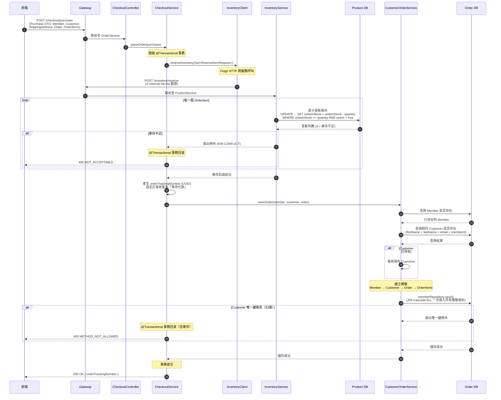

# Table of Contents
1. [Client-Side Features](#client-side-features)
2. [ER Diagram and Relational Schema Diagram](#er-diagram-and-relational-schema-diagram)
3. [Order Flow](#order-flow)
4. [Project Set Up](#project-set-up)

## Client-Side Features
> **用戶頁面 (身分: Visitor, User, Admin)**  
> 1. 登入  (Anyone)
> - 本地登入，儲存在資料庫的密碼會經過bcrypt雜湊演算法計算，以雜湊值儲存。
> - 初次登入需要攔截請求，在http header欄位新增authorization。
> - 登入成功後會保存JWT token在session storage。
> 2. 瀏覽商品 (Anyone)
> - 基於商品的分類來瀏覽對應分類的商品。
> - 可以透過關鍵字搜尋到名稱類似的商品。
> 3. 商品詳細資訊 (Anyone)
> - 有關商品的價格、存貨數量、介紹等等會顯示在這。
> - 加入到購物車的按鈕，並即時更新購物車狀態。
> 4. 購物車狀態 (Anyone)
> - 會常駐在上方導航欄，用戶點擊新增到購物車按鈕，會及時更新價格及數量，用Rxjs的BehaviorSubject class來推送購物車狀態給不同的component，達到即時更新的效果。
> - 購物車狀態有點擊事件會路由到購物車詳細資訊頁面。
> 5. 購物車詳細資訊 (Anyone)
> - 最後商品數量的追加以及刪除商品，追加商品時會及時更新數量和價格。
> - 追加商品有數量上的限制，這邊用的orderItem class有儲存存貨這個屬性，當跳轉到這頁面時會再從資料庫讀取最新存貨狀態。
> 6. 下訂單頁面 (User, Admin)
> - 有authentication guard，尚未登入的用戶會跳轉到登入畫面。
> - 點擊購買之後，將訂單存入資料庫，在( )有存訂單到資料庫和金流的詳細流程。
> - 屬於post請求，需要攔截請求在http header新增authorization，以及附帶csrf cookie(由後端生成)。
> 7. 查看訂單歷史 (User, Admin)
> - 有authentication guard，尚未登入的用戶會跳轉到登入畫面。
> - 可以查看訂購人資料、訂單編號、價格、數量、訂單狀態以及訂單日期。
> - 如果你在下訂單頁面沒有完成付款，可在這邊再送出一次付款請求。  

> **管理員頁面 (身分: Admin)**  
> **發送的請求都會更改到資料庫(post, delete, patch)，因此都需要攔截器的幫助加上JWT token以及csrf token的資訊。**
> 1. 修改商品以及刪除商品
> - 在瀏覽商品頁面中，每個商品的上方會有Modify和Remove按鈕，分別做修改商品詳細資訊和移除商品的功能。
> - 有authentication guard和role guard，需同時通過兩個guard才能有這兩個功能。
> 2. 新增商品
> - 可新增商品到資料庫，填寫完整的商品詳細資訊。
> - 有authentication guard和role guard，需同時通過兩個guard才能有這個功能。

## ER Diagram and Relational Schema Diagram
**ER Diagram**
- product_category有多個product，product對應到一個product_category。
- member可以創建多個customer。
- customer下訂單，且每筆訂單對應到一個運送地址，一筆訂單可以有多個訂單商品，訂單商品一定存在於product中。
---
  

**Relational Schema Diagram**


## Order Flow


```mermaid
sequenceDiagram
    autonumber
    participant 前端
    participant Gateway
    participant CheckoutController
    participant CheckoutService
    participant InventoryClient
    participant InventoryService
    participant ProductDB as Product DB
    participant CustomerOrderService
    participant OrderDB as Order DB

    前端->>Gateway: POST /checkout/purchase<br/>(Purchase DTO: Member, Customer,<br/>ShippingAddress, Order, OrderItems)
    Gateway->>CheckoutController: 路由至 OrderService

    CheckoutController->>CheckoutService: placeOrder(purchase)
    Note over CheckoutService: 開啟 @Transactional 事務

    CheckoutService->>InventoryClient: reserveInventory(Set<ReserveItemRequest>)
    Note over InventoryClient: Feign HTTP 跨服務呼叫
    InventoryClient->>Gateway: POST /inventory/reserve<br/>(X-Internal-Secret 驗證)
    Gateway->>InventoryService: 路由至 ProductService

    loop 每一個 OrderItem
        InventoryService->>ProductDB: 原子更新庫存<br/>UPDATE ... SET unitsInStock = unitsInStock - quantity<br/>WHERE unitsInStock >= quantity AND active = true
        ProductDB-->>InventoryService: 更新列數 (0 = 庫存不足)
        alt 庫存不足
            InventoryService-->>CheckoutService: 拋出例外 (409 CONFLICT)
            Note over CheckoutService: @Transactional 事務回滾
            CheckoutService-->>前端: 406 NOT_ACCEPTABLE
        end
    end

    InventoryService-->>CheckoutService: 庫存扣減成功

    CheckoutService->>CheckoutService: 產生 orderTrackingNumber (UUID)<br/>設定訂單狀態為「等待付款」

    CheckoutService->>CustomerOrderService: saveOrder(member, customer, order)
    CustomerOrderService->>OrderDB: 查詢 Member 是否存在
    OrderDB-->>CustomerOrderService: 已存在的 Member
    CustomerOrderService->>OrderDB: 查詢相同 Customer 是否存在<br/>(firstName + lastName + email + memberId)
    OrderDB-->>CustomerOrderService: 查詢結果

    alt Customer 已存在
        CustomerOrderService->>CustomerOrderService: 複用現有 Customer
    end

    Note over CustomerOrderService: 建立關聯<br/>Member → Customer → Order → OrderItems
    CustomerOrderService->>OrderDB: memberRepository.save()<br/>(JPA Cascade ALL 一次寫入所有關聯資料)

    alt Customer 唯一鍵衝突（幻讀）
        OrderDB-->>CustomerOrderService: 拋出唯一鍵例外
        Note over CheckoutService: @Transactional 事務回滾（含庫存）
        CheckoutService-->>前端: 405 METHOD_NOT_ALLOWED
    end

    OrderDB-->>CustomerOrderService: 儲存成功
    CustomerOrderService-->>CheckoutService: 儲存成功
    Note over CheckoutService: 事務提交
    CheckoutService-->>前端: 200 OK { orderTrackingNumber }
```


## Project Set Up
1. clone this repository
```
git clone https://github.com/Manders-Ma/eCommerce.git
```

2. install node_modules (client-side)
```
cd client/
npm install
```

3. 建立後端微服務的環境設定（PostgreSQL）

`OrderService` 和 `ProductService` 各自需要一份 `env.properties`，兩者格式相同。

```powershell
copy backend\OrderService\src\main\resources\env.properties.example `
     backend\OrderService\src\main\resources\env.properties

copy backend\ProductService\src\main\resources\env.properties.example `
     backend\ProductService\src\main\resources\env.properties
```

編輯兩份 `env.properties`（此檔已被 .gitignore 忽略，請勿將真實憑證推到版本庫），填入 PostgreSQL 連線參數及內部服務金鑰：

```
DB_HOST=localhost
DB_PORT=5432
DB_NAME=ecommerce
DB_USERNAME=postgres
DB_PASSWORD=your_db_password

# 微服務間內部呼叫的共用密鑰（OrderService 與 ProductService 須填入相同值）
INTERNAL_SECRET=your_internal_secret
```

4. 在本機建立資料庫並執行 SQL 腳本

專案已將 PostgreSQL 用的腳本放在 `db-script/postgres/`（`01-create-tables.sql`, `02-insert-sample-data.sql`）。推薦使用 `psql`（或 pgAdmin）執行。


5. [申請Line Pay sandbox帳戶取得ChannelId和ChannelSecret](https://pay.line.me/th/developers/main/main)

6. add a file as PaymentConstants. in server/src/main/java/com\manders/ecommerce/constants/
```
public class PaymentConstants {
  public static final String PaymentBaseUrl = "https://sandbox-api-pay.line.me";
  public static final String RequestUri = "/v3/payments/request";
  public static final String BaseUri = "/v3/payments";
  public static final String ChannelId = {your ChannelId};
  public static final String ChannelSecret = {your ChannelSecret};
}
```
