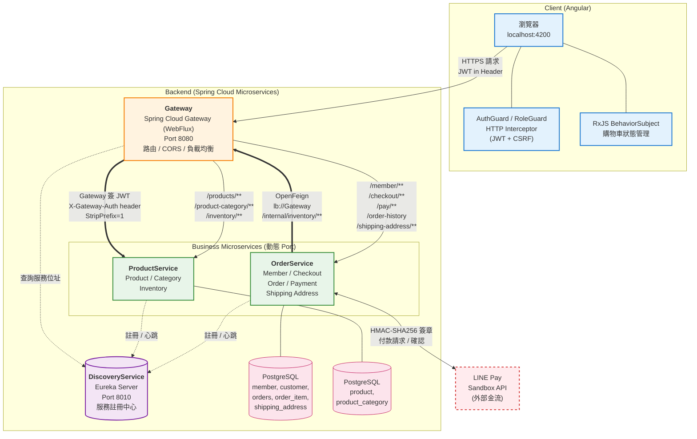
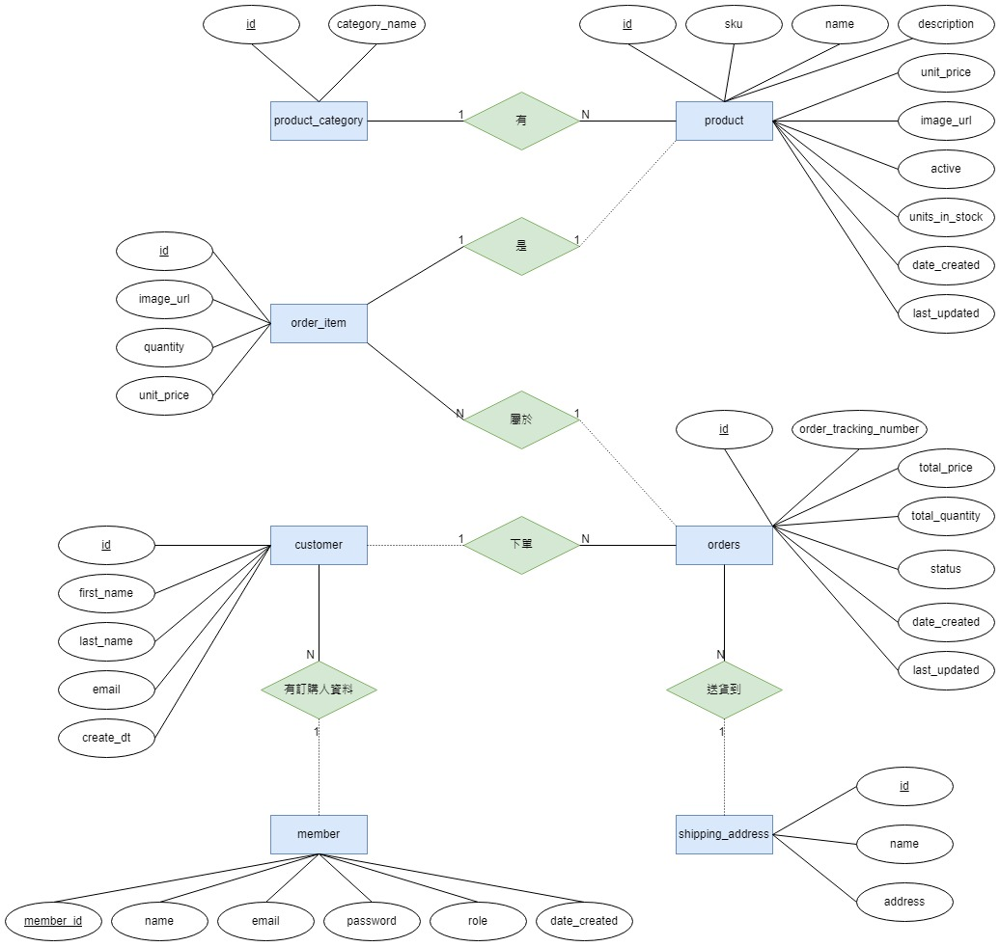
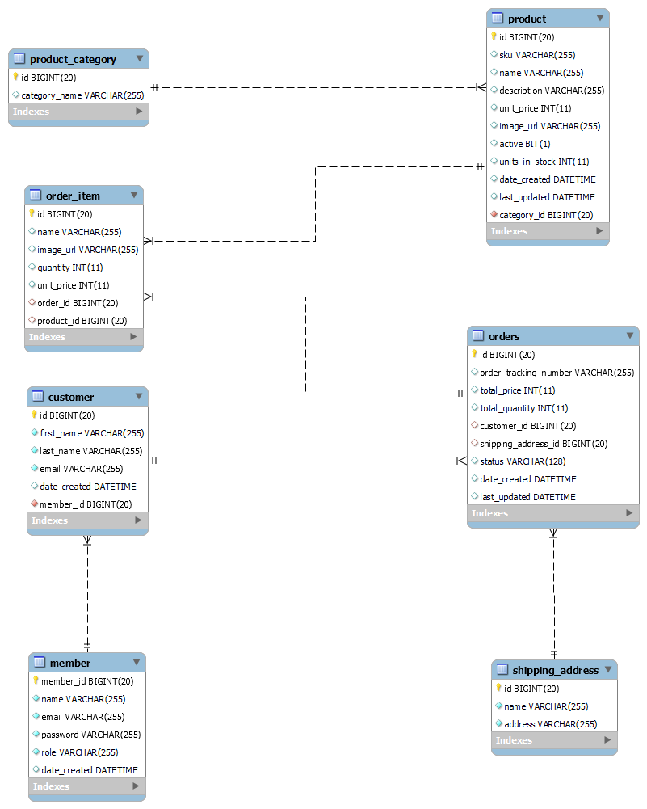
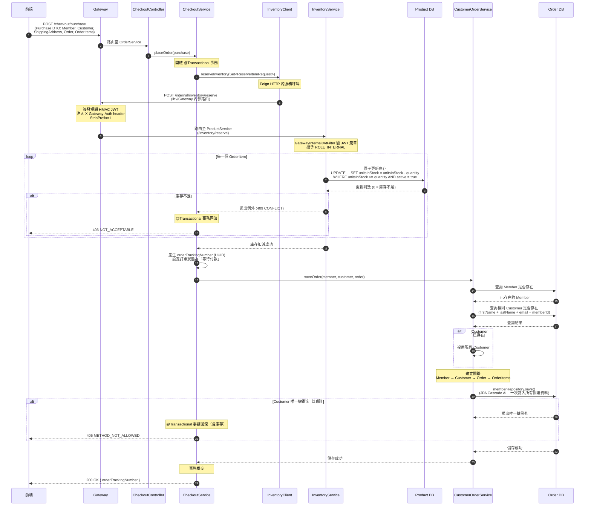

# Table of Contents
1. [System Architecture](#system-architecture)
2. [Client-Side Features](#client-side-features)
3. [ER Diagram and Relational Schema Diagram](#er-diagram-and-relational-schema-diagram)
4. [Order Flow](#order-flow)
5. [Project Set Up](#project-set-up)

## System Architecture

後端採用 Spring Cloud 微服務架構：透過 **Eureka** 做服務註冊與發現，**Spring Cloud Gateway** 作為唯一入口同時管理「外部請求」與「內部服務請求」：外部請求走 `/products/**`、`/checkout/**` 等公開路由；內部服務間呼叫 (如 OrderService → ProductService 預扣庫存) 走 `/internal/**` 前綴，由 Gateway 簽發短期 HMAC JWT (`X-Gateway-Auth` header) 給下游服務做驗證，取代過去共用 secret 的機制。


```mermaid
flowchart TB
    subgraph Client["Client (Angular)"]
        direction TB
        Browser["瀏覽器<br/>localhost:4200"]
        Guards["AuthGuard / RoleGuard<br/>HTTP Interceptor<br/>(JWT + CSRF)"]
        RxJS["RxJS BehaviorSubject<br/>購物車狀態管理"]
        Browser --- Guards
        Browser --- RxJS
    end

    subgraph Backend["Backend (Spring Cloud Microservices)"]
        direction TB

        Gateway["<b>Gateway</b><br/>Spring Cloud Gateway (WebFlux)<br/>Port 8080<br/>路由 / CORS / 負載均衡"]

        Eureka[("<b>DiscoveryService</b><br/>Eureka Server<br/>Port 8010<br/>服務註冊中心")]

        subgraph Services["Business Microservices (動態 Port)"]
            direction LR
            OrderSvc["<b>OrderService</b><br/>Member / Checkout<br/>Order / Payment<br/>Shipping Address"]
            ProductSvc["<b>ProductService</b><br/>Product / Category<br/>Inventory"]
        end

        OrderDB[("PostgreSQL<br/>member, customer,<br/>orders, order_item,<br/>shipping_address")]
        ProductDB[("PostgreSQL<br/>product,<br/>product_category")]
    end

    LinePay["LINE Pay<br/>Sandbox API<br/>(外部金流)"]

    Browser -->|"HTTPS 請求<br/>JWT in Header"| Gateway

    Gateway -->|"/member/**<br/>/checkout/**<br/>/pay/**<br/>/order-history<br/>/shipping-address/**"| OrderSvc
    Gateway -->|"/products/**<br/>/product-category/**<br/>/inventory/**"| ProductSvc

    OrderSvc -.->|註冊 / 心跳| Eureka
    ProductSvc -.->|註冊 / 心跳| Eureka
    Gateway -.->|查詢服務位址| Eureka

    OrderSvc ==>|"OpenFeign<br/>lb://Gateway<br/>/internal/inventory/**"| Gateway
    Gateway ==>|"Gateway 簽 JWT<br/>X-Gateway-Auth header<br/>StripPrefix=1"| ProductSvc

    OrderSvc --- OrderDB
    ProductSvc --- ProductDB

    OrderSvc <-->|"HMAC-SHA256 簽章<br/>付款請求 / 確認"| LinePay

    classDef client fill:#e3f2fd,stroke:#1976d2,stroke-width:2px
    classDef gateway fill:#fff3e0,stroke:#f57c00,stroke-width:2px
    classDef eureka fill:#f3e5f5,stroke:#7b1fa2,stroke-width:2px
    classDef service fill:#e8f5e9,stroke:#388e3c,stroke-width:2px
    classDef db fill:#fce4ec,stroke:#c2185b,stroke-width:1px
    classDef external fill:#ffebee,stroke:#d32f2f,stroke-width:2px,stroke-dasharray: 5 5

    class Browser,Guards,RxJS client
    class Gateway gateway
    class Eureka eureka
    class OrderSvc,ProductSvc service
    class OrderDB,ProductDB db
    class LinePay external
```

**元件說明**

| 元件 | 角色 |
|---|---|
| **Client (Angular)** | SPA 前端，含 AuthGuard / RoleGuard、HTTP Interceptor（自動附帶 JWT 與 CSRF token）、以 RxJS BehaviorSubject 推送購物車狀態 |
| **Gateway** (8080) | 唯一對外與對內入口，依路徑路由到對應微服務、由 Eureka 做負載均衡；同時處理 CORS。`/internal/**` 路由為服務間專用，Gateway 會剝除外部送入的 `X-Gateway-Auth` 並重新簽發短期 HMAC JWT 給下游 |
| **DiscoveryService / Eureka** (8010) | 服務註冊中心，所有後端服務啟動時向其註冊，Gateway / OrderService 透過它解析服務位址 |
| **OrderService** | 處理會員、訂單、付款、收件地址；透過 Feign 經由 Gateway (`lb://Gateway/internal/inventory/reserve`) 呼叫 ProductService 扣庫存；串接 LINE Pay |
| **ProductService** | 商品、商品分類與庫存管理；庫存扣減採用原子更新 SQL |
| **PostgreSQL** | 兩個微服務分別擁有自己的 schema，符合每服務一資料庫的原則 |
| **LINE Pay Sandbox** | 外部金流，OrderService 以 HMAC-SHA256 簽章串接付款請求與確認 |

## Client-Side Features
> **用戶頁面 (身分: Visitor, User, Admin)**  
> 1. 登入  (Anyone)
> - 本地登入，儲存在資料庫的密碼會經過bcrypt雜湊演算法計算，以雜湊值儲存。
> - 初次登入需要攔截請求，在http header欄位新增authorization。
> - 登入成功後會保存JWT token在session storage。
> 2. 瀏覽商品 (Anyone)
> - 基於商品的分類來瀏覽對應分類的商品。
> - 可以透過關鍵字搜尋到名稱類似的商品。
> 3. 商品詳細資訊 (Anyone)
> - 有關商品的價格、存貨數量、介紹等等會顯示在這。
> - 加入到購物車的按鈕，並即時更新購物車狀態。
> 4. 購物車狀態 (Anyone)
> - 會常駐在上方導航欄，用戶點擊新增到購物車按鈕，會及時更新價格及數量，用Rxjs的BehaviorSubject class來推送購物車狀態給不同的component，達到即時更新的效果。
> - 購物車狀態有點擊事件會路由到購物車詳細資訊頁面。
> 5. 購物車詳細資訊 (Anyone)
> - 最後商品數量的追加以及刪除商品，追加商品時會及時更新數量和價格。
> - 追加商品有數量上的限制，這邊用的orderItem class有儲存存貨這個屬性，當跳轉到這頁面時會再從資料庫讀取最新存貨狀態。
> 6. 下訂單頁面 (User, Admin)
> - 有authentication guard，尚未登入的用戶會跳轉到登入畫面。
> - 點擊購買之後，將訂單存入資料庫，在( )有存訂單到資料庫和金流的詳細流程。
> - 屬於post請求，需要攔截請求在http header新增authorization，以及附帶csrf cookie(由後端生成)。
> 7. 查看訂單歷史 (User, Admin)
> - 有authentication guard，尚未登入的用戶會跳轉到登入畫面。
> - 可以查看訂購人資料、訂單編號、價格、數量、訂單狀態以及訂單日期。
> - 如果你在下訂單頁面沒有完成付款，可在這邊再送出一次付款請求。  

> **管理員頁面 (身分: Admin)**  
> **發送的請求都會更改到資料庫(post, delete, patch)，因此都需要攔截器的幫助加上JWT token以及csrf token的資訊。**
> 1. 修改商品以及刪除商品
> - 在瀏覽商品頁面中，每個商品的上方會有Modify和Remove按鈕，分別做修改商品詳細資訊和移除商品的功能。
> - 有authentication guard和role guard，需同時通過兩個guard才能有這兩個功能。
> 2. 新增商品
> - 可新增商品到資料庫，填寫完整的商品詳細資訊。
> - 有authentication guard和role guard，需同時通過兩個guard才能有這個功能。

## ER Diagram and Relational Schema Diagram
**ER Diagram**
- product_category有多個product，product對應到一個product_category。
- member可以創建多個customer。
- customer下訂單，且每筆訂單對應到一個運送地址，一筆訂單可以有多個訂單商品，訂單商品一定存在於product中。
---
  

**Relational Schema Diagram**



## Order Flow


```mermaid
sequenceDiagram
    autonumber
    participant 前端
    participant Gateway
    participant CheckoutController
    participant CheckoutService
    participant InventoryClient
    participant InventoryService
    participant ProductDB as Product DB
    participant CustomerOrderService
    participant OrderDB as Order DB

    前端->>Gateway: POST /checkout/purchase<br/>(Purchase DTO: Member, Customer,<br/>ShippingAddress, Order, OrderItems)
    Gateway->>CheckoutController: 路由至 OrderService

    CheckoutController->>CheckoutService: placeOrder(purchase)
    Note over CheckoutService: 開啟 @Transactional 事務

    CheckoutService->>InventoryClient: reserveInventory(Set<ReserveItemRequest>)
    Note over InventoryClient: Feign HTTP 跨服務呼叫
    InventoryClient->>Gateway: POST /internal/inventory/reserve<br/>(lb://Gateway 內部路由)
    Note over Gateway: 簽發短期 HMAC JWT<br/>注入 X-Gateway-Auth header<br/>StripPrefix=1
    Gateway->>InventoryService: 路由至 ProductService<br/>(/inventory/reserve)
    Note over InventoryService: GatewayInternalJwtFilter 驗 JWT 簽章<br/>授予 ROLE_INTERNAL

    loop 每一個 OrderItem
        InventoryService->>ProductDB: 原子更新庫存<br/>UPDATE ... SET unitsInStock = unitsInStock - quantity<br/>WHERE unitsInStock >= quantity AND active = true
        ProductDB-->>InventoryService: 更新列數 (0 = 庫存不足)
        alt 庫存不足
            InventoryService-->>CheckoutService: 拋出例外 (409 CONFLICT)
            Note over CheckoutService: @Transactional 事務回滾
            CheckoutService-->>前端: 406 NOT_ACCEPTABLE
        end
    end

    InventoryService-->>CheckoutService: 庫存扣減成功

    CheckoutService->>CheckoutService: 產生 orderTrackingNumber (UUID)<br/>設定訂單狀態為「等待付款」

    CheckoutService->>CustomerOrderService: saveOrder(member, customer, order)
    CustomerOrderService->>OrderDB: 查詢 Member 是否存在
    OrderDB-->>CustomerOrderService: 已存在的 Member
    CustomerOrderService->>OrderDB: 查詢相同 Customer 是否存在<br/>(firstName + lastName + email + memberId)
    OrderDB-->>CustomerOrderService: 查詢結果

    alt Customer 已存在
        CustomerOrderService->>CustomerOrderService: 複用現有 Customer
    end

    Note over CustomerOrderService: 建立關聯<br/>Member → Customer → Order → OrderItems
    CustomerOrderService->>OrderDB: memberRepository.save()<br/>(JPA Cascade ALL 一次寫入所有關聯資料)

    alt Customer 唯一鍵衝突（幻讀）
        OrderDB-->>CustomerOrderService: 拋出唯一鍵例外
        Note over CheckoutService: @Transactional 事務回滾（含庫存）
        CheckoutService-->>前端: 405 METHOD_NOT_ALLOWED
    end

    OrderDB-->>CustomerOrderService: 儲存成功
    CustomerOrderService-->>CheckoutService: 儲存成功
    Note over CheckoutService: 事務提交
    CheckoutService-->>前端: 200 OK { orderTrackingNumber }
```


## Project Set Up
1. clone this repository
```
git clone https://github.com/Manders-Ma/eCommerce.git
```

2. install node_modules (client-side)
```
cd client/
npm install
```

3. 建立後端微服務的環境設定

`Gateway`、`OrderService`、`ProductService` 各自需要一份 `env.properties`。

```powershell
copy backend\Gateway\src\main\resources\env.properties.example `
     backend\Gateway\src\main\resources\env.properties

copy backend\OrderService\src\main\resources\env.properties.example `
     backend\OrderService\src\main\resources\env.properties

copy backend\ProductService\src\main\resources\env.properties.example `
     backend\ProductService\src\main\resources\env.properties
```

編輯各 `env.properties`（此檔已被 .gitignore 忽略，請勿將真實憑證推到版本庫）。

**Gateway**（負責簽發內部 JWT）：
```
# Gateway 簽發內部 JWT 的 HMAC 密鑰，須與 ProductService 填相同值（建議 ≥ 32 bytes）
GATEWAY_INTERNAL_JWT_SECRET=your_gateway_internal_jwt_secret
```

**OrderService**（含 LINE Pay 憑證）：
```
DB_HOST=localhost
DB_PORT=5432
DB_NAME=ecommerce
DB_USERNAME=postgres
DB_PASSWORD=your_db_password

# 至 LINE Pay 申請 sandbox 帳戶後取得
LINEPAY_CHANNEL_ID=your_channel_id
LINEPAY_CHANNEL_SECRET=your_channel_secret
```

> OrderService 自此不需要任何內部 secret — 對 ProductService 的呼叫一律走 Gateway (`/internal/**`)，由 Gateway 簽發 JWT。

**ProductService**：
```
DB_HOST=localhost
DB_PORT=5432
DB_NAME=ecommerce
DB_USERNAME=postgres
DB_PASSWORD=your_db_password

# 驗證 Gateway 簽發的內部 JWT；須與 Gateway 填相同值
GATEWAY_INTERNAL_JWT_SECRET=your_gateway_internal_jwt_secret
```

4. 在本機建立資料庫並執行 SQL 腳本

專案已將 PostgreSQL 用的腳本放在 `db-script/postgres/`（`01-create-tables.sql`, `02-insert-sample-data.sql`）。推薦使用 `psql`（或 pgAdmin）執行。

5. [申請 LINE Pay sandbox 帳戶取得 Channel ID 和 Channel Secret](https://pay.line.me/th/developers/main/main)，填入上方 `OrderService` 的 `env.properties`。
