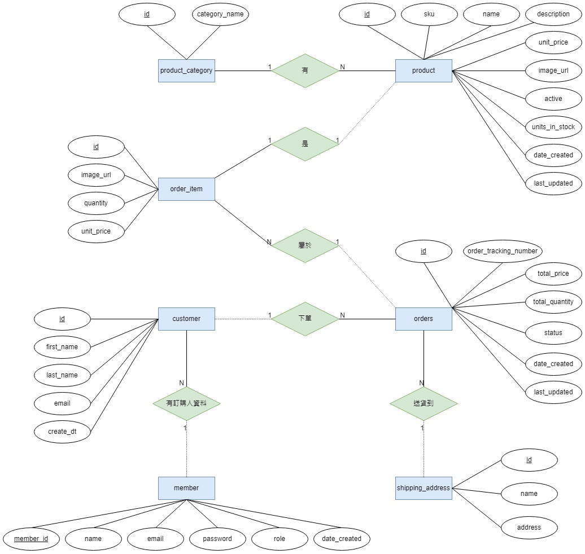

# Brief Introduction
- 前端Angular和後端Spring Boot的電商網站。
- 後端使用JWT進行身份驗證和授權，實現CSRF保護，思考真實情況下會發生的數據庫race condition問題，選擇適合的方式解決。  
- 前端可以根據商品分類瀏覽商品，將其添加到購物車中，並從購物車中修改或刪除商品，串接line pay api完成付款功能。某些頁面具有身份驗證guard和角色guard，以根據用戶角色區分功能。管理員用戶可以修改產品詳細資訊並添加新產品。


# Table of Contents
1. [Server-Side API Documentation](#server-side-api-documentation)
2. [Client-Side Features](#client-side-features)
3. [ER Diagram and Relational Schema Diagram](#er-diagram-and-relational-schema-diagram)
4. [Order Flow](#order-flow)
5. [Payment Flow](#payment-flow)
6. [Project Set Up](#project-set-up)  

## Server-Side API Documentation
Swagger api documentation (等待更新)

## Client-Side Features
> **用戶頁面 (身分: Visitor, User, Admin)**  
> 1. 登入  (Anyone)
> - 本地登入，儲存在資料庫的密碼會經過bcrypt雜湊演算法計算，以雜湊值儲存。
> - 初次登入需要攔截請求，在http header欄位新增authorization。
> - 登入成功後會保存JWT token在session storage。
> 2. 瀏覽商品 (Anyone)
> - 基於商品的分類來瀏覽對應分類的商品。
> - 可以透過關鍵字搜尋到名稱類似的商品。
> 3. 商品詳細資訊 (Anyone)
> - 有關商品的價格、存貨數量、介紹等等會顯示在這。
> - 加入到購物車的按鈕，並即時更新購物車狀態。
> 4. 購物車狀態 (Anyone)
> - 會常駐在上方導航欄，用戶點擊新增到購物車按鈕，會及時更新價格及數量，用Rxjs的BehaviorSubject class來推送購物車狀態給不同的component，達到即時更新的效果。
> - 購物車狀態有點擊事件會路由到購物車詳細資訊頁面。
> 5. 購物車詳細資訊 (Anyone)
> - 最後商品數量的追加以及刪除商品，追加商品時會及時更新數量和價格。
> - 追加商品有數量上的限制，這邊用的orderItem class有儲存存貨這個屬性，當跳轉到這頁面時會再從資料庫讀取最新存貨狀態。
> 6. 下訂單頁面 (User, Admin)
> - 有authentication guard，尚未登入的用戶會跳轉到登入畫面。
> - 點擊購買之後，將訂單存入資料庫，在( )有存訂單到資料庫和金流的詳細流程。
> - 屬於post請求，需要攔截請求在http header新增authorization，以及附帶csrf cookie(由後端生成)。
> 7. 查看訂單歷史 (User, Admin)
> - 有authentication guard，尚未登入的用戶會跳轉到登入畫面。
> - 可以查看訂購人資料、訂單編號、價格、數量、訂單狀態以及訂單日期。
> - 如果你在下訂單頁面沒有完成付款，可在這邊再送出一次付款請求。  

> **管理員頁面 (身分: Admin)**  
> **發送的請求都會更改到資料庫(post, delete, patch)，因此都需要攔截器的幫助加上JWT token以及csrf token的資訊。**
> 1. 修改商品以及刪除商品
> - 在瀏覽商品頁面中，每個商品的上方會有Modify和Remove按鈕，分別做修改商品詳細資訊和移除商品的功能。
> - 有authentication guard和role guard，需同時通過兩個guard才能有這兩個功能。
> 2. 新增商品
> - 可新增商品到資料庫，填寫完整的商品詳細資訊。
> - 有authentication guard和role guard，需同時通過兩個guard才能有這個功能。

## ER Diagram and Relational Schema Diagram
**ER Diagram**
- product_category有多個product，product對應到一個product_category。
- member可以創建多個customer。
- customer下訂單，且每筆訂單對應到一個運送地址，一筆訂單可以有多個訂單商品，訂單商品一定存在於product中。
---
  

**Relational Schema Diagram**


## Order Flow
  
- step1: 前端點擊購買按鈕並送出Purchase DTO給後端，Purchase DTO包含member、customer、shipping address、order以及orderitem等資訊
- step2: 由後端的CheckoutController來處理該POST請求，並交由CheckoutService的placeOrder方法來處理訂單，該方法是一個事務處理用@Transactional註解，且該方法在IventoryService及CustomerOrderService幫助之下完成訂單處理。
- step3: InventoryService的reserveInventory方法查看每個orderItem的數量並對數據庫更新庫存，考量到可能會發生更新丟失的問題，在update數據庫時使用原子更新，並在定義table時庫存欄位是unsigned，避免原子更新碰到負數問題。即使有一位客戶買的商品剛好被買完能觸發CheckoutService的事務回滾，所以才把@Transactional放在外部的方法中，確保在CheckoutService的placeOrder方法中有更改到數據庫的操作都做回滾。
- step4: 保留完商品，開始將此筆訂單存入數據庫，藉由CustomerOrderService的saveOrder方法，參數會傳入member、customer及order，目的是透過JPA對他們之間關聯的設定使得對member進行一次save操作即可將三項數據都寫入資料庫。可能在customer會發生幻讀的問題，由於發生的前提是同個member在不同裝置上搶購商品並填入相同的customer，所以在定義customer table可以放心用unique key來解決讓其中一個裝置的搶購失敗，若失敗觸發外部的@Transactional做事務回滾。
- step5: InventoryService的reserveInventory方法和CustomerOrderService的saveOrder方法，若錯誤會拋出不同的http status code讓前端針對不同錯誤做處理。


## Payment Flow


## Project Set Up
1. clone this repository
```
git clone https://github.com/Manders-Ma/eCommerce.git
```

2. install node_modules (client-side)
```
cd client/
npm install
```

3. add a file as env.properties in server/src/main/resources/
```
DB_DATABASE={database url}
DB_USER={user}
DB_PASSWORD={password}
```

4. run db script in db-script/
- create-table(product, product-category).sql
- create-table(member, customer, orders., order_item, shipping_address).sql
- insert-data-member.sql

5. [申請Line Pay sandbox帳戶取得ChannelId和ChannelSecret](https://pay.line.me/th/developers/main/main)

6. add a file as PaymentConstants. in server/src/main/java/com\manders/ecommerce/constants/
```
public class PaymentConstants {
  public static final String PaymentBaseUrl = "https://sandbox-api-pay.line.me";
  public static final String RequestUri = "/v3/payments/request";
  public static final String BaseUri = "/v3/payments";
  public static final String ChannelId = {your ChannelId};
  public static final String ChannelSecret = {your ChannelSecret};
}
```